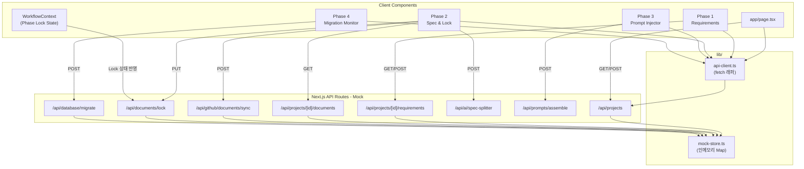

# Factory-Pipe Frontend-API Stitching 작업 계획

## 현재 상태 요약

- UI: 4개 Phase 페이지 완성, `PhaseAccessGuard`, `WorkflowContext` 구현 완료
- 데이터: 모두 `localStorage` 기반 (서버 없음)
- API: `app/api/` 디렉터리 자체가 없음
- 타입: `lib/projects.ts`에 간단한 `Project` 타입만 존재, 중앙화된 `types/` 없음

---

## 1. 생성/수정 핵심 파일 목록

### 신규 생성

| 파일 경로 | 역할 |
|---|---|
| `types/index.ts` | DB 스키마 + API 계약을 반영한 공통 타입 모음 |
| `app/api/projects/route.ts` | GET (목록), POST (생성) |
| `app/api/projects/[id]/route.ts` | GET (단건), PATCH (수정) |
| `app/api/projects/[id]/requirements/route.ts` | GET / POST |
| `app/api/projects/[id]/documents/route.ts` | GET (문서 목록) |
| `app/api/github/documents/sync/route.ts` | POST — GitHub 커밋 Mock |
| `app/api/documents/lock/route.ts` | PUT — Workflow Lock |
| `app/api/ai/spec-splitter/route.ts` | POST — AI 명세 분할 Mock |
| `app/api/ai/judge/route.ts` | POST — AI 검증 Mock |
| `app/api/prompts/assemble/route.ts` | POST — 프롬프트 조립 Mock |
| `app/api/database/migrate/route.ts` | POST — SQL 실행 Mock |
| `lib/api-client.ts` | fetch 래퍼 함수 모음 (타입 안전 클라이언트) |

### 수정

| 파일 경로 | 변경 내용 |
|---|---|
| `app/page.tsx` | 프로젝트 목록/생성을 localStorage → API 바인딩 |
| `contexts/workflow-context.tsx` | Phase Lock 상태를 API 응답 기반으로 동기화 |
| `app/project/[id]/phase/1/page.tsx` | Requirements GET/POST API 연결 |
| `app/project/[id]/phase/2/page.tsx` | Documents GET, Sync POST, Lock PUT 연결 |
| `app/project/[id]/phase/3/page.tsx` | Prompts Assemble POST 연결 |
| `app/project/[id]/phase/4/page.tsx` | Migrate POST + 로그 GET 연결 |
| `lib/projects.ts` | `Project` 타입을 `types/index.ts`로 이전, 스토리지 로직 제거 준비 |

---

## 2. 공통 TypeScript 타입 정의 계획 (`types/index.ts`)

DB 스키마(`01_db_schema.md`)와 API 계약(`02_api_routes.md`)을 각각 두 레이어로 분리 정의한다.

### Layer 1 — DB Row 타입 (DB 스키마 1:1 매핑)

```typescript
// DB 테이블 행을 그대로 반영
export interface UserRow {
  id: string;
  email: string;
  github_username: string | null;
  created_at: string;
}

export interface ProjectRow {
  id: string;
  user_id: string;
  name: string;
  description: string | null;
  status: string;        // 'active' | ...
  created_at: string;
  updated_at: string;
}

export interface DocumentRow {
  id: string;
  project_id: string;
  doc_type: '00_overview' | '01_db_schema' | '02_api_routes' | '03_frontend_ui';
  content: string;
  status: 'Draft' | 'Final' | 'Implemented';
  version: number;
  updated_at: string;
}

export interface MigrationLogRow {
  id: string;
  project_id: string;
  sql_query: string;
  status: 'success' | 'failed';
  applied_at: string;
}

export interface RequirementRow {
  id: string;
  project_id: string;
  question_key: string;
  answer_text: string;
  created_at: string;
  updated_at: string;
}
```

### Layer 2 — API Request/Response 타입 (엔드포인트별 계약)

```typescript
// POST /api/github/documents/sync
export interface SyncDocumentRequest {
  project_id: string;
  doc_type: DocumentRow['doc_type'];
  content: string;
  commit_message: string;
}
export interface SyncDocumentResponse {
  status: 'success';
  commit_sha: string;
}

// PUT /api/documents/lock
export interface LockDocumentRequest { document_id: string; status: 'Final'; }
export interface LockDocumentResponse { status: 'locked'; next_phase_unlocked: boolean; }

// POST /api/ai/spec-splitter
export interface SpecSplitterRequest { project_id: string; overview_content: string; }
export interface SpecSplitterResponse {
  '01_db_schema': string;
  '02_api_routes': string;
  '03_frontend_ui': string;
}

// POST /api/ai/judge
export interface JudgeRequest { target_doc_type: string; code_snippet: string; }
export interface JudgeResponse { is_valid: boolean; feedback: string; violation_points: string[]; }

// POST /api/prompts/assemble
export interface AssembleRequest { project_id: string; target_phase: string; }
export interface AssembleResponse { assembled_prompt: string; }

// POST /api/database/migrate
export interface MigrateRequest { project_id: string; sql_query: string; }
export interface MigrateResponse { status: 'success' | 'failed'; log_id?: string; error_message?: string; }
```

---

## 3. Mock API 라우트 구축 계획

### 원칙

- 모든 라우트는 실제 Supabase/GitHub 연동 없이 **인메모리 Map 또는 고정 fixture**로 응답
- 응답 구조는 `types/index.ts`의 타입과 정확히 일치 (나중에 실제 구현으로 swap 용이)
- `Authorization` 헤더 검사 로직은 `// TODO: Supabase Auth 검증` 주석으로 자리 보전
- 딜레이(`await new Promise(r => setTimeout(r, 300))`) 삽입으로 실제 네트워크 UX 시뮬레이션

### Mock 저장소 전략

```
lib/mock-store.ts   ← 서버 전역 Map (process.env.NODE_ENV === 'development'에서만 사용)
  mockProjects: Map<string, ProjectRow>
  mockDocuments: Map<string, DocumentRow[]>   // key: project_id
  mockRequirements: Map<string, RequirementRow[]>
  mockMigrationLogs: Map<string, MigrationLogRow[]>
```

### 엔드포인트별 Mock 응답 요약

| 라우트 | Method | Mock 동작 |
|---|---|---|
| `/api/projects` | GET | `mockProjects` 값 배열 반환 |
| `/api/projects` | POST | 새 `ProjectRow` 생성 후 Map 저장, 반환 |
| `/api/projects/[id]` | GET | Map에서 id 조회 |
| `/api/projects/[id]/requirements` | GET/POST | `mockRequirements[id]` 조작 |
| `/api/projects/[id]/documents` | GET | `mockDocuments[id]` 반환 (없으면 `DEFAULT_SPECS`로 초기화) |
| `/api/github/documents/sync` | POST | content를 `mockDocuments`에 저장, 가짜 `commit_sha` 반환 |
| `/api/documents/lock` | PUT | `mockDocuments`의 status → 'Final' 업데이트 |
| `/api/ai/spec-splitter` | POST | `DEFAULT_SPECS`(`lib/spec-defaults.ts`) 내용을 그대로 반환 |
| `/api/ai/judge` | POST | `{ is_valid: true, feedback: "Mock 검증 통과", violation_points: [] }` 반환 |
| `/api/prompts/assemble` | POST | Final 문서들을 조합한 고정 프롬프트 문자열 반환 |
| `/api/database/migrate` | POST | 쿼리를 `mockMigrationLogs`에 저장, `status: 'success'` 반환 |

---

## 4. 프론트엔드 데이터 바인딩 순서와 로직

### 아키텍처 흐름



### 바인딩 우선순위 및 로직 (순서대로 진행)

**Step 1 — `app/page.tsx` (홈 화면)**
- `useEffect`에서 `GET /api/projects` 호출 → 프로젝트 목록 상태 바인딩
- "New Project" 모달 Submit → `POST /api/projects` 호출 → 응답 `id`로 라우팅
- `loadProjects()` / `addProject()` (localStorage) 호출 제거

**Step 2 — `contexts/workflow-context.tsx`**
- `GET /api/projects/[id]/documents` 응답으로 각 `doc_type`의 `status`를 읽어 `PhaseLocks` 초기화
- `lockPhase` 호출 시 `PUT /api/documents/lock` 병렬 호출 추가 (localStorage 유지는 fallback으로 잠시 병용)

**Step 3 — Phase 1 (`requirements`)**
- 진입 시 `GET /api/projects/[id]/requirements` 호출 → textarea 초기값 설정
- "Phase 1 확정" 버튼 → `POST /api/projects/[id]/requirements` + `lockPhase(1)` 순서 실행

**Step 4 — Phase 2 (`spec & lock`) — 가장 복잡**
- 진입 시 `GET /api/projects/[id]/documents` → 탭별 content 로드 (DB 우선, 없으면 `DEFAULT_SPECS` fallback)
- `[GitHub Sync]` → `POST /api/github/documents/sync` → 반환된 `commit_sha` 토스트로 표시
- `[Approve & Lock]` → `PUT /api/documents/lock` (3개 doc 모두) → 성공 시 `lockPhase(2)` 호출
- AI 생성 버튼(선택) → `POST /api/ai/spec-splitter` → 탭 content 교체

**Step 5 — Phase 3 (`prompt injector`)**
- 타겟 선택(Cursor/v0) 후 생성 버튼 → `POST /api/prompts/assemble` 호출
- 응답 `assembled_prompt` → 읽기 전용 textarea에 바인딩
- 기존 클라이언트 사이드 문자열 조합 로직 제거

**Step 6 — Phase 4 (`migration monitor`)**
- `[Execute & Sync]` → `POST /api/database/migrate` 호출
- 응답 `status` + `log_id` → 로그 패널에 실시간 append
- `GET /api/projects/[id]/migration-logs` (별도 라우트) → 이력 목록 표시

---

## 5. `lib/api-client.ts` 설계

모든 fetch를 타입 안전하게 감싸는 얇은 클라이언트 레이어.

```typescript
// 사용 예시
const projects = await apiClient.getProjects()           // ProjectRow[]
const doc = await apiClient.syncDocument(payload)        // SyncDocumentResponse
const lock = await apiClient.lockDocument(payload)       // LockDocumentResponse
```

- 에러 시 `{ error: string; status: number }` 형태로 reject
- 추후 `Authorization: Bearer {token}` 헤더를 한 곳에서 주입 가능한 구조

---

## 6. 작업 순서 (권장)

1. `types/index.ts` — 타입 정의 (다른 모든 파일의 기반)
2. `lib/mock-store.ts` — 인메모리 저장소
3. API 라우트 11개 (순서: projects → requirements → documents → sync → lock → spec-splitter → assemble → migrate)
4. `lib/api-client.ts` — fetch 래퍼
5. `WorkflowContext` 수정 (API 기반 Lock 초기화)
6. Phase별 페이지 바인딩 (1 → 2 → 3 → 4 → 홈 순서)
